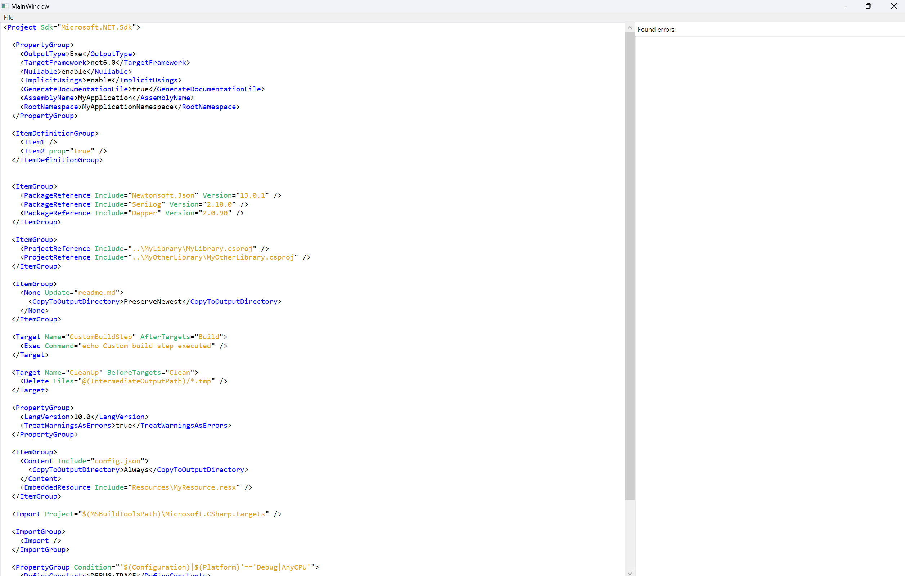
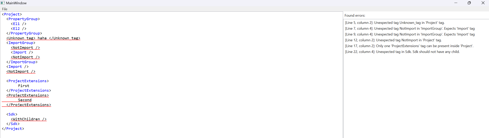

# MSBParser

MSBParser is a GUI application made with WPF for analyzing MSBuild (.csproj) files.
Its core features are:

- parsing file into a tree structure with `ProjectNode` at its root
- syntax highlighting for different parts of the file (elements, attributes, values)
- finding syntax errors, highlighting them, and showing corresponding error messages

The main goal of this project is to properly parse MSBuild files, identify errors based on the parsed data, and provide syntax highlighting. There are some minor bugs with the highlighting itself, but as it's more WPF and frontend-related, I didn't invest much time into that — I focused primarily on the backend side of the application.

When developing the app I used [Microsoft Docs](https://learn.microsoft.com/en-us/visualstudio/msbuild/msbuild-project-file-schema-reference?view=vs-2022) as reference.

Currently, the application only checks for syntax errors in "Elements" (e.g., it shows an error if an unknown tag is found inside `Project`). However, no checks are made on the attributes and their values (meaning that if a tag should always have an attribute and the attribute is not provided, MSBParser will **not** consider it an error).

## Examples

- MSBuild file without any errors:
  
- MSBuild file with errors:
  
